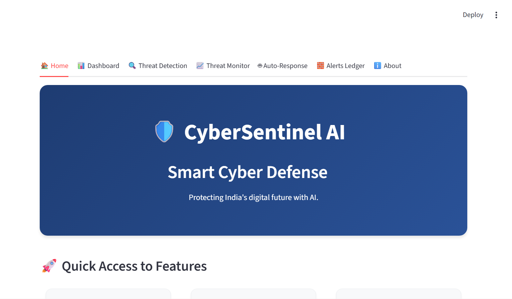
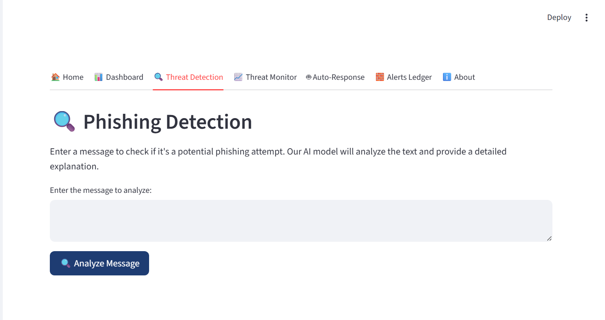
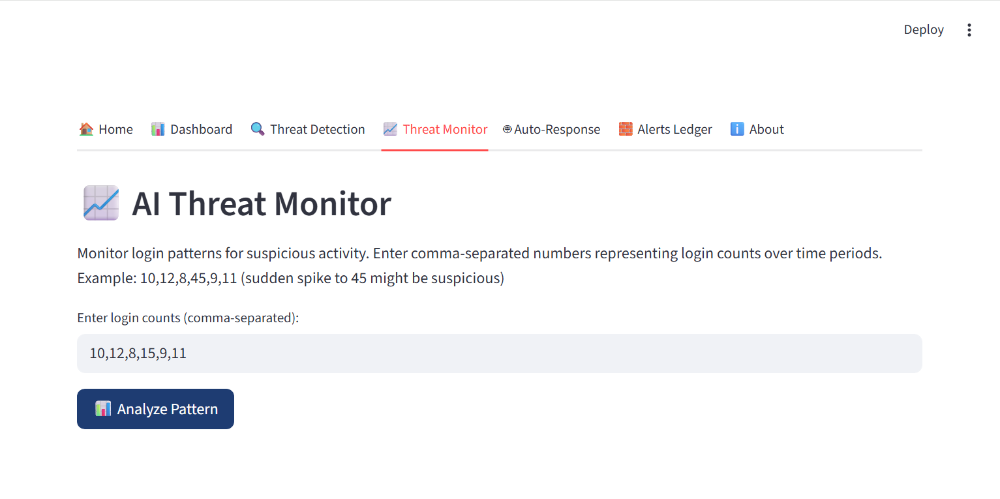
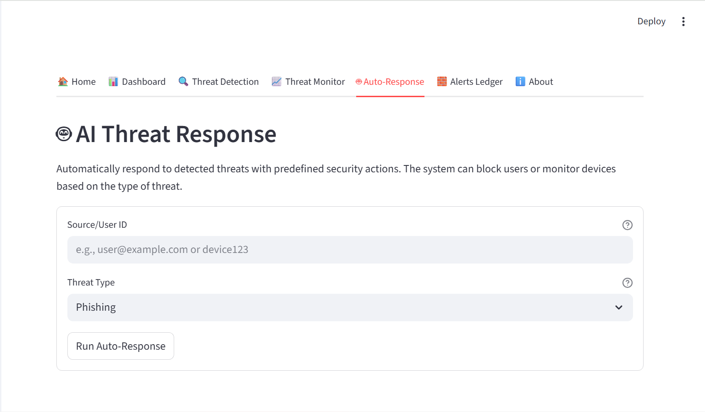

# 🛡️ CyberSentinel AI – Smart Cyber Defense
### Protecting India's Digital Future with Artificial Intelligence

An AI-powered cybersecurity system that detects phishing, monitors suspicious logins, logs alerts to a blockchain ledger, and generates instant reports.

## ⚙️ Features
- 🧠 Phishing Message Detector
- 👀 AI Threat Monitor
- 🧱 Blockchain Alert Ledger
- 🔊 Voice & Auto Response
- 📄 Security Report Generator

## 🧩 Tech Stack
- Python  
- FastAPI (Backend)  
- Streamlit (Frontend)  
- Scikit-learn (AI Model)  
- hashlib, pandas, matplotlib  

## 🚀 How to Run

1. Clone this repo
   ```bash
   git clone https://github.com/<nikhilmanvi360>/CyberSentinel-AI.git
   ```

2. Create and activate virtual environment
   ```bash
   python -m venv .venv
   source .venv/bin/activate  # Linux/Mac
   .venv\Scripts\activate     # Windows
   ```

3. Install dependencies
   ```bash
   pip install -r requirements.txt
   ```

4. Start the backend server
   ```bash
   python -m uvicorn backend:app --reload
   ```

5. Start the frontend (in a new terminal)
   ```bash
   python -m streamlit run frontend.py
   ```

6. Open in browser: http://localhost:8501

## 📸 Screenshots

| Feature | Screenshot |
|---------|------------|
| Home Dashboard |  |
| Phishing Detection |  |
| AI Threat Monitor |  |
| Alert Ledger |  |
| AI Threat Analysis |  |

## 🔒 Security Features

- Real-time phishing detection using ML
- Anomaly detection in login patterns
- Blockchain-based alert verification
- Voice-enabled threat notifications
- Automated incident response
- Comprehensive security reporting

## ✨ Key Highlights

- Beginner-friendly UI/UX
- Fast API response times
- Secure data handling
- Voice-enabled alerts
- Downloadable reports
- Blockchain integrity

## 🤝 Contributing

This project was created for a hackathon demo. Feel free to fork and enhance it!

1. Fork the repository
2. Create your feature branch
3. Commit your changes
4. Push to the branch
5. Open a Pull Request

## 📝 License

MIT License - feel free to use this project for learning and development!